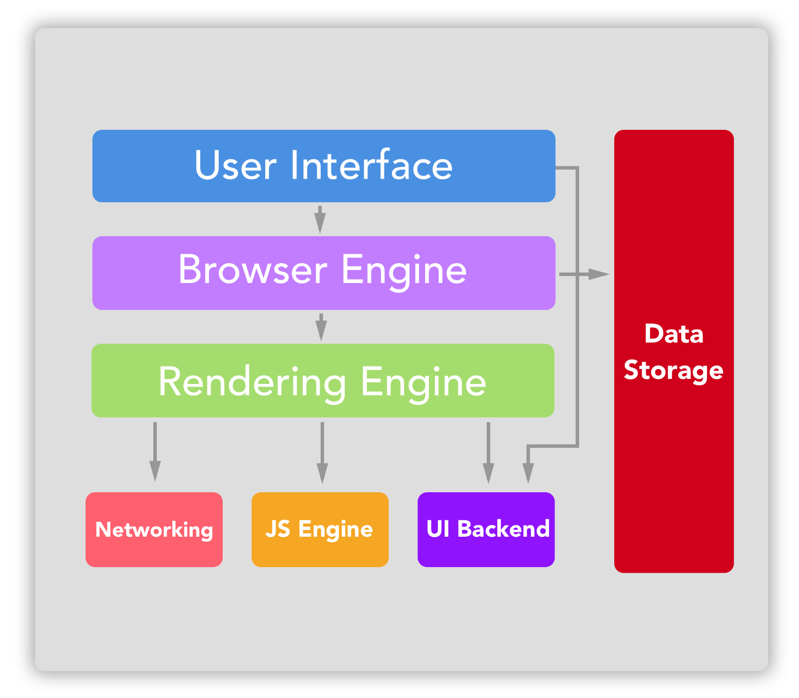
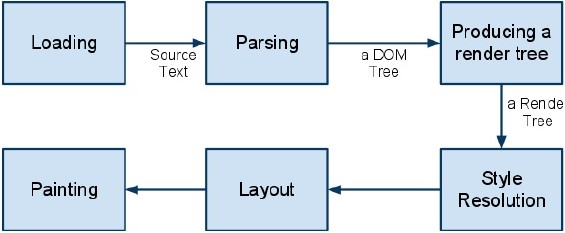
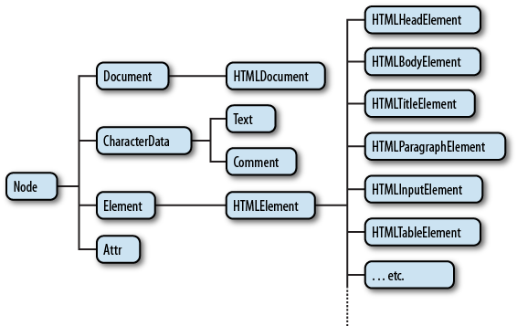

웹 개발자라면, 특히 프론트엔드 개발자라면 필수로 알아야할 브라우저에 관한 포스팅입니다.

## 1. 브라우저란 무엇인가

- 브라우저는 사용자가 원하는 자원 (HTML, PDF, 이미지 등의 요소)을 서버에 요청하고 받아와 브라우저화면에 표시해줍니다.
- 브라우저가 HTML을 해석하고 화면에 나타내는 방법은 HTML, CSS 표준을 따르게 되는데 브라우저에 따라 스펙을 따르는 정도가 조금씩 다를 수 있습니다.

## 2. 브라우저 기본 구성 요소

- UI

    UI는 다음과 같은 요소들을 공통적으로 갖고있습니다.

  - 각 브라우저의 URI를 입력할 수 있는 주소검색창
  - 뒤로가기/앞으로가기 버튼
  - 북마크
  - 새로고침 / 정지 버튼
  - 홈 버튼

- Browser Engine

  - 렌더링 엔진에 작업을 요청하고 다루는 인터페이스로 구성되어 있습니다.

- Rendering Engine

  - 요청된 컨텐츠를 화면에 표시하기 위한 필수적인 부분
  - 서버로부터 응답받은 HTML, CSS 파일을 [파싱](https://www.scienceall.com/%ED%8C%8C%EC%8B%B1parsing/)해줍니다.
파싱된 파일들은 DOM, CSSOM 트리로 변환되고 렌더 트리로 결합됩니다.
렌더 트리를 기반으로 브라우저는 웹페이지를 표시헙니다.

- Networking

  - HTTP request 같은 네트워크 호출을 다룹니다.
  - 각 플랫폼에 의존적인 부분과 플랫폼에 독립적인 인터페이스로 구성 되어 있습니다.

- UI Backend

  - 콤보박스나 윈도우와 같은 기본 위젯을 화면에 그려줍니다.

- JS Engine

  - 자바스크립트 코드를 해석하고 실행해줍니다.

- Data Storage

  - 쿠키, Local Storage 등 브라우저 메모리를 활용하여 저장하는 영역

## 3. 브라우저의 실행 흐름

- 브라우저가 화면에 컨텐츠를 렌더링 해주기 까지 어떤 흐름을 갖는지 살펴보겠습니다.
  

  불러오기 -> 파싱(DOM Tree 생성) -> 자바스크립트 실행 -> 레이아웃 작업 -> CSS 처리 -> 그리기

1. 불러오기(Loading)

    - HTTP 모듈 또는 파일시스템 등으로 전달받은 리소스 스트림을 읽는 과정입니다.
    - Loader가 이 역할을 하며 데이터를 읽으면서 이미 읽은 데이터인지, 팝업창을 열지, 파일을 다운받을지 결정해줍니다.

2. 파싱(Parsing)

    - 파싱은 DOM Tree를 만드는 과정입니다.
  
    - 렌더링 엔진은 HTML, XML 파서를 각각 가지고 있는데, HTML, XML 문서를 파싱하고 내부에서 태그를 DOM 노드로 변환합니다.
    - DOM Tree는 HTML/XML 문서의 내용을 트리 형태로 자료구조화 한것입니다.

3. Render Tree 생성

    - DOM Tree는 내용 자체를 저장하고 있고, 화면에 표시하기 위한 위치와 크기 정보, 그리는 순서 등을 저장하기 위한 별도의 트리구조인 Rendering Tree가 필요합니다.
    - Rendering Tree에는 페이지를 렌더링 하는데 필요한 가시적인 Node만 포함 됩니다. 따라서 HTML의 메타태그(`<head> <title> <body>`)나 스크립트 태그 같은 Node나 display : none으로 스타일이 지정된 Node는 Rendering Tree에 추가되지 않습니다.
    - 하지만 visibility : hidden 스타일이 적용된 Node는 보이지 않지만 공간을 차지하므로 포함이 됩니다.
    - Rendering Tree가 화면에 최종적으로 그려지는 내용이 됩니다.
    

4. CSS 스타일 결정

    - CSS는 셀렉터(특정 요소를 선택하고 스타일을 적용할 수 있게 해줌)에 따라서 적용되는 태그가 다릅니다. 따라서 모든 CSS 스타일을 분석하여 최종적으로 어떤 태그에 어떤 스타일 규칙이 적용 되는지를 결정합니다.

5. 레이아웃 작업

    - Rendering Tree가 생성될 때 렌더객체는 위치나 크기를 갖고있지 않습니다. 객체들에게 위치와 크기를 정해주는 과정을 레이아웃 이라고 합니다.

6. 그리기

    - 렌더링 트리를 탐색 하면서 특정 메모리 공강에 RGB값을 채우는 과정입니다. 그릴 대상을 자세하게 적어놓은 카드가 있다고 가정합시다. 그 카드들을 모아놓은 뭉치에서 맨 윗장부터 하나씩 꺼내어 적힌 대상을 빈종이에 그리는것과 비슷하다고 볼 수 있습니다.

브라우저 첫번째 포스트에서는 브라우저의 개념, 구성 요소, 주요 실행 흐름에 대해 알아보았습니다. 다음 포스트에서는 렌더링 엔진의 구체적인 동작 과정과, 스크립트와 CSS 처리 순서에 대해 알아보겠습니다.

## Reference

- [브라우저 동작 원리](https://poiemaweb.com/js-browser)
- [브라우저는 어떻게 동작하는가?](https://d2.naver.com/helloworld/59361)
- [웹 브라우저는 어떻게 동작하나?](https://www.slideshare.net/joone/ss-9376827)