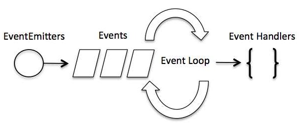

※ Node.js 공식문서를 번역한 글입니다.

Node.js는 싱글 스레드 어플리케이션이다. 하지만 event와 callback 개념을 통해 동시성을 지원할 수 있다. Node.js의 모든 API는 비동기적이며 싱글 스레드이다. 동시성을 유지하기 위해 비동기 함수 호출을 사용한다. Node는 [observer](https://ko.wikipedia.org/wiki/%EC%98%B5%EC%84%9C%EB%B2%84_%ED%8C%A8%ED%84%B4) 패턴을 사용한다. Node 스레드는 event loop를 유지하고있다가 작업이 완료될 때마다 해당 event(event-listener를 실행하라는 신호를 보낸다)를 실행한다.

## Event-Driven Programming

Node.js는 event를 많이 사용하는데 이것이 다른 유사한 기술에 비해 Node.js가 매우 빠른 이유중 하나이다. Node는 서버를 시작하자마자 변수를 초기화하고 함수를 선언하고 event가 발생할 때까지 기다린다.

event-driven 어플리케이션에는 일반적으로 event들을 listen하고 하나의 event가 탐지되면 callback 함수를 동작시키는 main loop가 있다.



event가 callback과 상당히 유사해 보이지만, 차이가 있다. callback 함수는 비동기 함수가 결과를 반환할 때 호출되는 반면에 event handling은 observer 패턴에서 작용한다는 다른점이 있다.

event listen 함수들은 observer의 역할을 한다. event가 실행될 때 마다 listener 기능이 실행되기 시작한다. Node.js에는 다양한 내장 event가 있는데, 다음과 같이 `events` 모듈 과 `EventEmitter` 클래스를 통해 event 와 event listner를 바인딩할 수 있다.

```javascript
// events 모듈 사용
var events = require('events');

// EventEmitter 객체 생성
var eventEmitter = new events.EventEmitter();
```

다음은 event handler를 event와 바인딩 하는 구문이다.

```javascript
// Bind event and event  handler as follows
eventEmitter.on('eventName', eventHandler);
```

프로그램안에서 event를 발생시킬때 다음과 같이 사용할 수 있다.

```javascript
// Fire an event
eventEmitter.emit('eventName');
```

## 이벤트 핸들링 예제

다음 코드를 가진 main.js파일을 생성하십시오

```javascript
// events 모듈 사용
var events = require('events');

// EventEmitter 객체 생성
var eventEmitter = new events.EventEmitter();

// EventHandler 함수 생성
var connectHandler = function connected(){
    console.log("connection successful");

    // data_recevied 이벤트를 발생시키기
    eventEmitter.emit("data_received");
}

// connection 이벤트와 connectHandler 이벤트 핸들러를 연동
eventEmitter.on('connection', connectHandler);

// data_received 이벤트와 익명 함수와 연동
// 함수를 변수안에 담는 대신에, .on() 메소드의 인자로 직접 함수를 전달
eventEmitter.on('data_received', function(){
   console.log('data received succesfully.');
});

// connection 이벤트 발생시키기
eventEmitter.emit('connection');

console.log("Program Ended.");
```

이제 위의 프로그램을 실행하고 출력을 확인하십시오.

```powershell
$ node main.js
connection successful.
data received successfully.
Program Ended.
```

## Reference

- [Node.js - Event Loop](https://www.tutorialspoint.com/nodejs/nodejs_event_loop.htm)