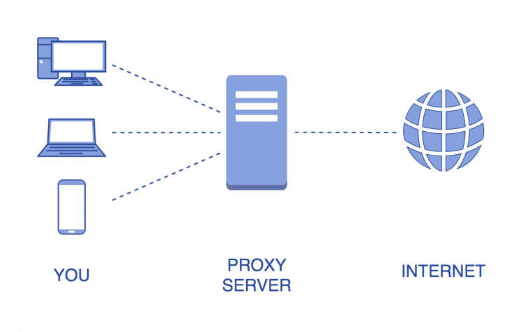

## Proxy의 개념

'대리'라는 뜻을 가진 Proxy는 네트워킹 및 웹 트래픽에서 다른 장치를 대신하는 장치 또는 서버를 뜻하는 개념입니다. Proxy Server는 클라이언트와 서버 사이에서 중계기로서 대리로 요청과 응답을 수행합니다.

## Proxy서버를 사용하는 이유

사용자가 검색한 웹사이트로 가고 싶을 때 사용자와 웹서버 중간에 있는 proxy 서버에서는 사용자를 대신하여 웹페이지를 인터넷에서 검색한 다음 받아온 웹페이지를 사용자에게 보내줍니다. 사용자가 인터넷으로 부터 바로 정보를 받으면 편할 텐데 굳이 중간에 proxy서버를 넣는 이유가 있을까요? proxy서버를 사용하는 이유에 대해 알아봅시다.

### 1. Privacy

proxy는 사용자의 IP주소를 숨겨 익명으로 인터넷을 검색할 수 있게 해줍니다. proxy를 사용하지 않고 웹사이트를 방문할 경우 사용자의 public IP주소와 방문 기록을 다른 이들이 볼 수 있습니다. 하지만 proxy 서버를 사용하게 되면 proxy 서버의 IP로 웹페이지 요청을 대신해 주기 때문에 사용자의 IP주소와 방문기록을 다른 이들이 볼 수 없게 됩니다.

### 2. Speed

proxy를 사용하여 빠른 속도를 보장받을 수 있습니다. 어떤 회사에서 proxy 서버를 사용한다고 가정해봅시다. A직원이  웹페이지를 검색하면 proxy 서버는 A직원을 대신하여 인터넷에서 해당 웹페이지를 검색합니다. proxy서버는 인터넷으로부터 응답받은 웹페이지를 중앙 집중식 캐시 데이터베이스에 저장합니다. 만약 B직원이 A직원과 같은 웹페이지를 검색할 경우 proxy는 인터넷에 접속할 필요 없이 캐시 데이터베이스에서 해당 자료를 검색하여 즉시 B직원에게 웹페이지를 보내줍니다. 이러한 시스템은 웹페이지 검색속도를 훨씬 빠르게 해줍니다.

### 3. Saves bandwidth

proxy를 사용하여 대역폭을 절약할 수 있습니다. 데이터 검색시에 캐시 데이터베이스에 해당 데이터가 저장되어있는 경우 인터넷에서 데이터를 검색할 수고를 덜어줍니다. 또한 외부와의 트래픽을 줄이게 됨으로써 네트워크 병목현상을 방지할 수 있습니다.

### 4. Activity Logging

 proxy는 사용자의 웹사이트 방문기록, 얼마나 오랫동안 해당 웹사이트에 있었는지에 대한 로그기록을 보관합니다. 그리고 사용자가 특정 웹사이트에 방문하는 것을 차단하도록 환경설정을 할 수 있습니다. 이는 아이들로부터 성인 컨텐츠를 차단하거나, 회사에서 특정 문서에 접근을 제어하는 등으로 활용 할 수 있습니다.

## 보안문제

프록시 서버는 당신의 데이터를 암호화해주지 않습니다. 이는 다른 이들이 중간에서 데이터를 가로챌 수 있는 위험이 있습니다. 이러한 보안 문제때문에 VPN이 나오게 되었습니다. VPN이나 가상 사설 네트워크를 이용하여 사용자의 IP주소를 숨기고, 데이터를 암호화하여 해당 보안문제를 해결할 수 있습니다. VPN에 관한 자세한 내용은 다른 포스팅에서 다루겠습니다.
