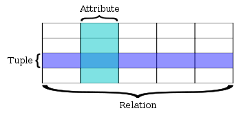

***SQL(관계형 데이터베이스)*** 과 ***NoSQL***에 대해 알아보겠습니다.

## SQL(관계형 데이터베이스)

관계형 데이터베이스는 데이터 항목 간에 사전 정의된 관계가 있을 때 그러한 데이터 항목들의 모음을 가리킵니다. 이들 항목은 열과 행으로 이루어진 테이블 집합으로 구성됩니다. 테이블은 데이터베이스에 표시할 해당 객체들에 관한 정보를 수록하는 데 사용됩니다.

테이블의 각 열은 특정 종류의 데이터를 수록하며 필드는 속성의 실제 값을 저장합니다. 테이블의 행은 한 객체 또는 엔터티와 관련된 값들의 모음을 나타냅니다. 테이블의 각 행은 기본 키라고 부르는 고유 식별자로 표시할 수 있고 여러 테이블에 있는 행들은 외래 키를 사용하여 상호 연결될 수 있습니다.

## 관계형 데이터베이스의 특징

### SQL(Structured Query Language) 사용

- 관계형 데이터베이스와 통신하는데 사용되는 기본 인터페이스 입니다. SQL은 데이터의 행을 추가, 업데이트, 삭제할 수 있고 트랜잭션 처리 및 분석 애플리케이션용 데이터의 하위 집합을 검색하며, 데이터베이스의 모든 측면을 관리하는데 사용됩니다.

### 데이터 무결성 보장

- 데이터 무결성이란 데이터의 전체적인 완전성, 정확성 및 일관성을 의미합니다. 관계형 데이터베이스는 일련의 제약 조건을 사용하여 데이터베이스 내에서 데이터 무결성을 적용합니다.

### 엄격한 스키마

- 데이터는 테이블에 레코드로 저장되며, 각 테이블에는 명확하게 정의된 구조가 있습니다. 해당 테이블의 스키마를 준수하지 않으면 레코드를 추가할 수 없습니다.

### ACID 속성

- ACID(atomicity, consistency, isolation, durability) 속성을 제공합니다.

## NoSQL

NoSQL은 위에 설명한 관계형 데이터베이스에 반하는 비관계형 데이터베이스 입니다. Not Only SQL의 줄임말로 SQL을 개선하고 보안한다는 의미로 이해하면 될것같습니다.

### NoSQL의 등장배경

정보화가 가속화됨에 따라 이전에는 별로 신경쓰지 않았던 부분들까지 데이터화 하여 저장하는 일들이 많아지게 되었습니다.(SNS, Game, IoT 등) 이는 이전까지 사용했던 관계형 데이터베이스만으로는 해결할 수 없는 상황들을 발생시켰고 한계를 극복하기 위해 NoSQL이라는 데이터 저장 기술이 나오게 되었습니다.

## NoSQL 특징

### 데이터들이 관계가 없음

NoSQL은 데이터들이 서로 관계가 없습니다. 이는 기존의 관계형 데이터베이스보다 더 유연하고 융통성 있는 메커니즘을 제공합니다.

### 제품에 따른 다양한 특성

- 관계형 데이터베이스 제품군(MySQL, Oracle 등)과 같이 공통된 형태의 데이터 저장방식과 접근방식을 갖는것이 아니라 제품에 따라 각각의 특성이 매우 다릅니다. 따라서 NoSQL은 하나의 제품군으로 정의할 수 없습니다. 

### 대용량 데이터 저장

- 관계형 데이터베이스의 복잡도와 용량 한계를 극복하기 위한 목적으로 등장한 만큼, 페타바이트급의 대용량 데이터를 저장할 수 있습니다. 또한 분산형 컴퓨팅에 유리한 NoSQL 특성상 대용량 저장에 용이합니다.

### 분산형 구조

- NoSQL은 분산형 구조를 따르고 있기 때문에 구조에 제약이 없고, 장비의 수를 늘리는 수평적 확장이 용이합니다. 기존 SQL이 확장을 위해 장비의 성능을 향상시키는 수직적 확장에 집중하는 것과는 대조적입니다.

## NoSQL 종류

NoSQL의 DB의 종류는 크게 4가지 유형이 있습니다.

### 1. Key-Value DB

출처 : https://en.wikipedia.org/wiki/Key-value_database

Key와 Value의 쌍으로 데이터가 저장되는 기본적인 저장방식 입니다. 구조가 단순하기 때문에 속도가 빠르고 분산 저장시에 용이합니다. 읽기 중심의 애플리케이션(SNS, Q&A포털)에 최적화되어 있습니다. Rial, Vodemort, Tokyo등의 제품이 있습니다.

### 2. Wide Columnar DB

출처: https://database.guide/what-is-a-column-store-database/

컬럼 형식 데이터베이스는 데이터의 행이 아니라 데이터의 컬럼을 읽고 쓰는데 최적화된 데이터베이스 입니다. 그림을 보면 사용자의 이름(key)에 해당하는 값의 스키마들이 각각 다른것을 알 수 있습니다. 이는 디스크의 I/O 요구사항과 디스크에서 로드해야 하는 데이터의 양을 줄여주므로, 데이터의 압축, 분산처리, 확장성, 데이터베이스 분석 성능에 중요한 요소입니다. HBase, "Cassandra, Hypertable이 이에 해당됩니다.

### 3. Document DB

출처: https://inyl.github.io/programming/2017/05/09/database.html

JSON, XML과 같은 반정형 데이터 모델 구조를 채택하고 있습니다. 비관계형 문서별로 다른 스키마를 적용할 수 있도록 좀 더 유연하게 스키마를 적용할 수 있습니다. 트리형 구조로 레코드를 저장하거나 검색하는데 효과적입니다. MongoDB, CoughDB가 이 종류에 해당됩니다.

### 4. Graph DB

출처 : https://database.guide/what-is-a-graph-database/

데이터를 노드로 포현하며 노드 사이의 관계를 엣지로 표현합니다. 관계형 데이터베이스 보다 유연하며 유지보수에 용이합니다. Nodes, Relationship, Key-Value 데이터 모델을 채용하고 있습니다.

## SQL vs NoSQL

출처 : https://medium.com/hackernoon/sql-vs-nosql-what-is-better-for-you-cc9b73ab1215

### SQL을 사용하는 경우

- 관계를 맺고 있는 데이터가 자주 변경 되는 애플리캐이션인 경우

- 변경될 일이 거의 없고, 명확한 스키마가 사용자와 데이터에 중요한 경우

### NoSQL을 사용하는 경우

- 정확한 데이터 구조를 알 수 없거나 변경/ 확장될 수 있는 경우

- 짧은 시간 안에 DB 구조가 자주 변경되는 경우

- 읽기처리를 자주 하지만, 데이터를 자주 변경하지 않는 경우

- 많은 양의 데이터베이스를 수평으로 확장해야하는 경우

사실 SQL과 NoSQL의 사용 경우에 대한 정답은 없습니다. 개인이 더 중요시하는 DB의 장점이 무엇인지에 따라 선택이 달라질 수 있습니다. 각각의 차이점을 잘 이해하고 나의 애플리케이션 개발에 좀더 편리한 DB형태가 무엇인지 잘 판단하여 사용하시기 바랍니다.
