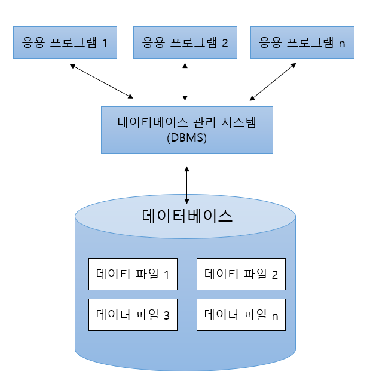

## 자료(data) vs 정보

- 자료 : 개별 사실들의 집합, 정량화된 수치
- 정보 : 데이터에 기준을 부여하고 의미를 도출

## 데이터베이스의 개념

- 특정 기업이나 조직 또는 개인이 필요에 의해 논리적으로 연관된 데이터를 모아 일정한 형태로 저장해 놓은 것

- 한 조직의 여러 응용 시스템들이 공용(Shared)으로 사용 하기 위해 통합(Integrated), 저장(Stored)한 운영 데이터(Operational data)의 집합

## DBMS(Database Management System)

- 데이터베이스 관리 프로그램

- DBMS를 이용하여 데이터 입력, 수정, 삭제 등의 기능 제공

## 데이터베이스의 특징

데이터베이스는 개인이 소장하는 자료가 아니라 특정 조직의 모든 데이터를 통합해서 관리하기 위한 데이터들의 모임입니다.

### 1. 통합된 데이터(Integrated Data)

- 데이터를 통합하는 개념
- 각자 사용하던 데이터의 중복을 최소화하여 중복으로 인한 데이터 불일치 현상 제거

### 2. 저장된 데이터(Stored Data)

- 문서로 보관된 데이터가 아닌 하드디스크 같은 컴퓨터 저장장치에 저장된 데이터

### 3. 운영 데이터(Operationcal Data)

- 조직의 목적을 위해 사용되는 데이터
- 업무를 위한 검색을 할 목적으로 저장된 데이터

### 4. 공용 데이터(Shared Data)

- 한 사람 또는 한 업무를 위해 사용되는 데이터가 아니라 공동으로 사용되는 데이터

데이터베이스는 엑셀과 다르게 여러명이 한번에 관리를 할 수 있다는 장점이 있음.

엑셀에서는 사이즈의 제한이 있음. 무한으로 데이터를 넣을 수 없음. 데이터베이스는 데이터를 제한없이 넣고 관리할 수 있음

## DBMS 장점

### 데이터 중복의 최소화

- 데이터를 관리를 한곳에서 하기 때문에 데이터 중복을 줄일 수 있습니다.

### 일관성 유지

- 데이터 관리를 한곳에서 하기 때문에 데이터의 일관성을 유지하기가 쉬워집니다.

### 데이터의 공용

- 동시에 여러명이 작업할 수 있습니다.

### 무결성 유지

- 제약조건을 걸어서 무결성을 체크할 수 있습니다.

### 보안 보장

- 데이터 관리를 한곳에서 하기 때문에 데이터에 대한 보안작업을 더 효율적으로 할 수 있습니다.

### 표준화 용이

- 데이터의 표준화를 통해 체계적으로 중앙 제어 기능을 수행할 수 있습니다.

### 전체 데이터 요구 사항 조정

- 조직에서 요구하는 데이터를 수집하고, 충돌하는 데이터를 조정하여 효율적인 정보 처리를 보장할 수 있습니다.
