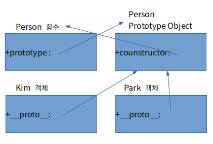

자바스크립트는 class 기반의 객체지향 프로그래밍 언어와 달리 prototype을 기반으로 하는 언어이기 때문에 class 없이 객체를 생성할 수 있습니다. (ECMA6 표준에서 class 문법이 추가가 되었지만 자바스크립트가 class 기반으로 바뀐것은 아닙니다.)

## Prototype은 무엇일까요

- Prototype은 원형, 원본 이라는 뜻을 가지고 있습니다.

- 자바스크립트의 모든 객체는 자신을 생성한 객체 원형에 대한 숨겨진 연결을 갖습니다. 이때 자기 자신을 생성하기 위해 사용된 객체원형을 prototype이라 합니다. 즉 어떠한 객체가 만들어지기 위해 그 객체의 모태가 되는 녀석을 prototype이라고 합니다.

## Prototype은 왜 쓰이는 걸까요

아래 예시를 살펴보겠습니다.

```javascript
function Person() {
    this.nose = '1';
    this.eyes = '2';
}

var kim = new Person();
var park = new Person();
```

kim과 park은 nose와 eyes를 공통으로 갖고있지만 메모리에는 eyes와 nose가 각각 할당이 되어 총 4개가 됩니다. 이렇게 객체가 많아지면 중복되는 데이터가 생기기 때문에 메모리의 낭비가 발생합니다. prototype으로 위의 문제를 해결할 수 있습니다.

```javascript
function Person() {}

Person.prototype.nose = 1;
Person.prototype.eyes = 2;

var kim = new Person();
var park = new Person();
```

Person.prototype이라는 빈 Object가 어딘가에 존재하고, Person함수로 부터 생성된 객체(kim, park)들은 어딘가에 존재하는
Object에 들어있는 값을 모두 갖다쓸 수 있습니다. 즉 kim과 park이 Object를 공유해서 사용하고 있고 이는 메모리의 낭비를 방지할 수 있습니다.

## Prototype Link & Prototype Object

Prototype Link와 Prototype Object를 통틀어 prototype이라고 합니다.

### Prototype Object

Prototype Object는 생성 당시의 정보를 갖고있는 자기 자신의 또다른 복제품입니다. 나를 통해 객체가 생성이되면 새로 생성된 객체는 Prototype Object를 참조합니다.



자바스크립트에서 함수를 생성하면 함수 객체만 생성되는 것이 아니라 prototype이라는 객체도 동시에 생성이 됩니다. 이 두 객체는 서로 이어져 있어서 함수는 Prototype Object를 참조하고 prototype에서는 constructor로 함수에 접근할 수 있습니다.

### Prototype Link

```javascript
function Person() {}

Person.prototype.nose = 1;
Person.prototype.eyes = 2;

var kim = new Person();
var park = new Person();

console.log(kim.eyes); // 2
console.log(park.nose); // 1
```

kim에는 eyes라는 속성이 없는데도 kim.eyes를 실행하면 2라는 값을 참조하는 것을 볼 수 있습니다. 위에서 설명했듯이 Prototype Object에 존재하는 eyes 속성을 참조한 것인데요, kim이 가지고 있는 __proto__가 그것을 가능하게 합니다.

prototype 속성은 함수만 가지고 있던 것과는 달리(그림 참조) __proto__속성은 모든 객체가 빠짐없이 가지고 있는 속성입니다. __proto__는 객체가 생성될 때 조상이었던 함수의 Prototype Object를 가리킵니다. kim객체는 Person함수로부터 생성되었으니 Person 함수의 Prototype Object를 가리키고 있는 것이죠.

kim객체가 eyes를 직접 가지고 있지 않기 때문에 eyes 속성을 찾을 때 까지 상위 프로토타입을 탐색합니다. 최상위인 Object의 Prototype Object까지 도달했는데도 못찾았을 경우 undefined를 리턴합니다. 이렇게 __proto__속성을 통해 상위 프로토타입과 연결되어있는 형태를 **프로토타입 체인(Chain)** 이라고 합니다.

이런 프로토타입 체인 구조 때문에 모든 객체는 Object의 자식이라고 불리고, Object Prototype Object에 있는 모든 속성을 사용할 수 있습니다.
