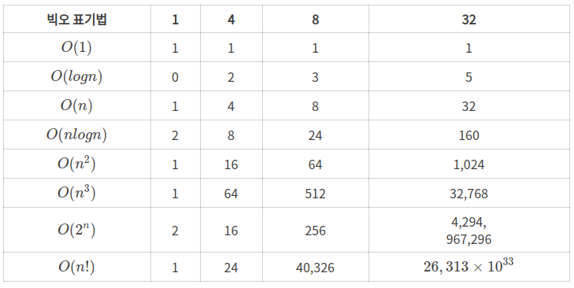

알고리즘 문제를 풀다보면 코드의 복잡도가 높아 테스트 통과를 못할 때가 있습니다. 복잡도란 무엇일까요? 이번 포스팅에서는 `시간복잡도`와 `공간복잡도` 에 대해 알아보겠습니다.

## 시간복잡도(Time Complexity)

문제를 해결하는데 걸리는 시간과 입력의 함수 관계를 뜻합니다. 시간 복잡도는 `Big-O 표기법`을 사용하여 나타내며, 자료의 크기 n에 대하여 O(n)의 시간 복잡도를 가진 알고리즘은 대략 크기 n에 비례하는 연산을 수행합니다.



n의 값이 커지면 커질수록, 시간복잡도가 복잡한 알고리즘의 수행시간이 늘어납니다.
계산법을 살펴보면, Big-O는 `worst case`를 기준으로 하기때문에 `최고차항만`을 계산하며 나머지값들은 버립니다.

```javascript
let sum = 0;
for (let i = 0; i < 1000; i++) {
  sum += i;
}
```

연산이 10^3회 발생하므로 시간복잡도는 10^3 이 됩니다.

## 공간 복잡도(Space Complexity)

문제를 해결하는데 얼마나 많은 메모리를 사용하는가에 대한 개념인데 크게 두가지로 구분할 수 있습니다.

1. 프로그램 수행을 위해 시스템이 필요로 하는 공간, 프로그램 코드를 저장하기 위한 공간
2. 문제를 해결하기 위한 알고리즘을 수행할 때 필요한 공간(변수, 함수, recursion stack 등)

주로 2번의 경우를 공간복잡도를 계산하는데 사용합니다.
