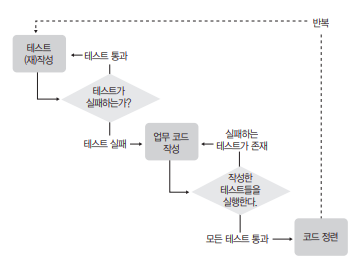

## 테스트 주도 개발

고전적인 개발 방식에서 쉽게 나타나는 몇가지 문제점

1. 특정 모둘의 개발 기간이 길어질수록 개발자의 목표의식이 흐려진다.
2. 작업 분량이 늘어날수록 확인이 어려워진다.
3. 논리적인 오류를 찾기가 어렵다.
4. 테스트를 실행하는게 점점 귀찮아져서 간소화하는 항목들이 늘어난다.
5. 코드 수정 시에 기존 코드의 정상 동작에 대한 보장이 어렵다.
6. 개발자의 노동력을 적지 않게 소모한다.

### TDD란

TDD를 주도한 켄트 벡은 TDD를 다음과 같이 정의했다.

> "프로그램을 작성하기 전에 테스트를 먼저 작성하는 것"

### TDD의 목표

'잘 동작하는 깔끔한 코드' => 유지보수의 편의성, 가독성, 소프트웨어의 비용과 안정성

### TDD의 진행 방식



- 질문(ASK): 테스트 작성을 통해 시스템에 질문. (테스트 수행결과는 실패)
- 응답(Respond): 테스트를 통과하는 코드를 작성해서 질문에 대다한다.(테스트 성공)
- 정제(Refine): 아이디어를 통합하고, 불필요한 것은 제거하고, 모호한 것은 명확히 해서 대답을 정제한다. (리팩토링)
- 반복(Repeat): 다음 질문을 통해 대화를 계속 진행한다.

### 진행 방식 예

은행 계좌 클래스를 만들어보자.

#### 첫 번째 질문 : 계좌 생성 테스트

1. 구현해야 할 기능을 파악하고, 목록을 작성

    - 클래스 이름은 Account
    - 기능은 세가지 (잔고 조회, 입금, 출금)

2. 계좌 생성 기능을 구현하기 위한 최초의 테스트 케이스를 만들고 실패하는 모습을 확인한다.

    - 테스트 케이스를 하나씩 추가해가면서 구현 클래스를 점진적으로 만드는 방식을 채택

#### 첫 번째 응답 : 계좌 생성 메소드 구현

1. 계좌 생성 테스트 케이스를 통과하는 코드를 작성한다

#### 최초의 정제

1. 리펙토링을 적용할 부분이 있는지 찾아본다.

    - 소스의 가독성이 적절한가?
    - 중복된 코드는 없는가?
    - 이름이 잘못 부여된 메소드나 변수명은 없는가?
    - 구조의 개선이 필요한 부분은 없는가?

2. ToDo목록에서 완료된 부분을 지운다.

#### 두 번째 질문 : 잔고 조회

1. 잔고 조회 기능 작성을 위한 테스트 케이스를 작성한다.
2. 테스트 수행 결과가 오류로 표시된 항목은 실패 항목으로 만든다.

#### 두 번째 응답 : 잔고 조회 기능 구현

1. 앞서 작성된 테스트 케이스를 이용해 잔고 조회 기능을 구현한다.
2. 테스트 실패시에 메시지를 보여줄 수 있는 구조를 생각해본다.

#### 두 번째 정제

1. 구현된 잔고 조회 로직에 대한 리팩토링 작업을 한다.
2. 본격적으로 테스트 프레임 워크를 사용한다.

#### 세 번째 질문 : 입금과 출금 테스트

1. 입금과 출금 기능을 구현하기 위한 테스트 케이스를 작성한다.

#### 세 번째 응답 : 입금과 출금 기능 구현

1. 입금과 출금 기능을 구현한다.

#### 세 번째 정제

1. 중복해서 나타나는 계좌 클래스 생성 부분을 리팩토링한다.
2. 테스트에 사용할 객체를 초기화하기 위한 setUp메소드를 구현한다.
3. ToDo목록에 작성된 부분을 제거한다.

조금씩 짧은 보폭으로 빨리 걷는 습관을 들이도록 노력하자. 그렇게 연습하다 보면 한 보폭의 속도가 매우 빨라질 것이며 문제가 생겼을 때도 조금만 뒤로가면 되기 때문에 빠르고 효율적으로 해결이 가능하다.

## TDD 좀 더 잘하기

### 테스트 케이스 클래스의 위치

#### 소스 폴더는 다르게, 패키지는 동일, 컴파일된 클래스는 각각 다른 곳으로

|            |                                |
|:-----------|:------------------------------ |
|     장점    | 대상 클래스와 테스트 클래스를 동일한 패키지로 선언할 수 있다. 접근 범위(scope) default 나 protected로 선언된 메소드도 테스크 케이스로 작성할 수 있다. 컴파일된 대상 클래스와 테스트 클래스의 위치가 최상위 폴더부터 다르게 만들어지기 때문에, 서로 섞일 염려가 없다|
|     단점    | 환경 구성 방법이 IDE에 의존적이다|
|    선호도    | 매우높음, 대부분의 사람에게 가장 권하는 스타일|

### 테스트 메소드 작성 방식

#### 테스트 대상 메소드의 이름 뒤에 추가적인 정보를 기재

```java
@Test
public void testWithdraw_마이너스통장인출(){}

@Test
public void testWithdraw_잔고가0원일때(){}
```
