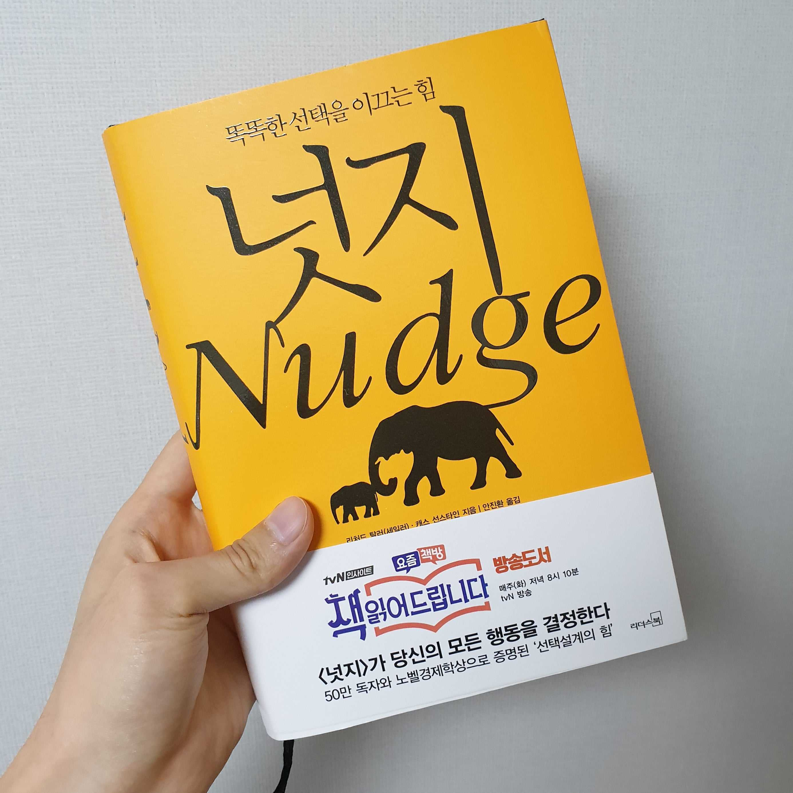

노벨 경제학상을 수상한 리처드 탈러와 오바마 정부에서 오바마의 '공공정책 멘토'로 불렸던 캐스 선스타인이 집필한 행동경제학 서적이다.

'넛지'는 '팔꿈치로 슬쩍 옆구리찌르기' 라는 뜻의 행동경제학 용어로 선택설계자가 유연하고 비강제적으로 개입하여 사람들의 행동을 변화시키는 일종의 간섭이다. 사람들의 건강을 위해 정크푸드를 강제로 금지하는것이 아니라 과일을 눈에 잘 띄는 위치에 놓아 몸에 좋은 제품을 구매하도록 유도하는것이다.

경제에 문외한인 내가 이 책을 읽게된 이유는 저자가 표지에 넣은 코끼리가 엉덩이를 밀어주는 그림과 '똑똑한 선택을 이끄는 힘' 이라는 문구 때문이었다. 어른코끼리가 아이코끼리를 밀어주듯이 이 책이 나를 올바른 선택으로 밀어줄것 같았기 때문이다. 어떻게 보면 저자의 넛지가 성공한 셈이다. 

저자는 저축, 사회보장제도, 신용 시장, 환경 정책, 의료서비스. 결혼 등에서 나타나는 넛지의 사례들을 다루며 두가지 주장을 펼친다. 첫번째는 사소해 보이는 사회적 상황들이 사람들의 행동에 막대한 영향을 미칠 수 있다는것이고 두번째는 선택설계자들이 사람들의 삶을 개선시키는 방향으로 넛지를 가한다는 것이다.

책을 읽으며 아쉬웠던 점은 대부분의 사례가 미국에 관한 사례이다 보니 읽는 와중에 흥미가 다소 떨어졌다 정도이지만 나의 작은 선택이 타인에게 미치는 영향에 관하여 깊게 생각해볼 수 있는 유익한 시간이었다. '책 읽어드립니다'에서 나온 넛지의 흥미로운 사례들만 보고 이 책을 선택했다면 각오하고 보는게 좋을것이다.
