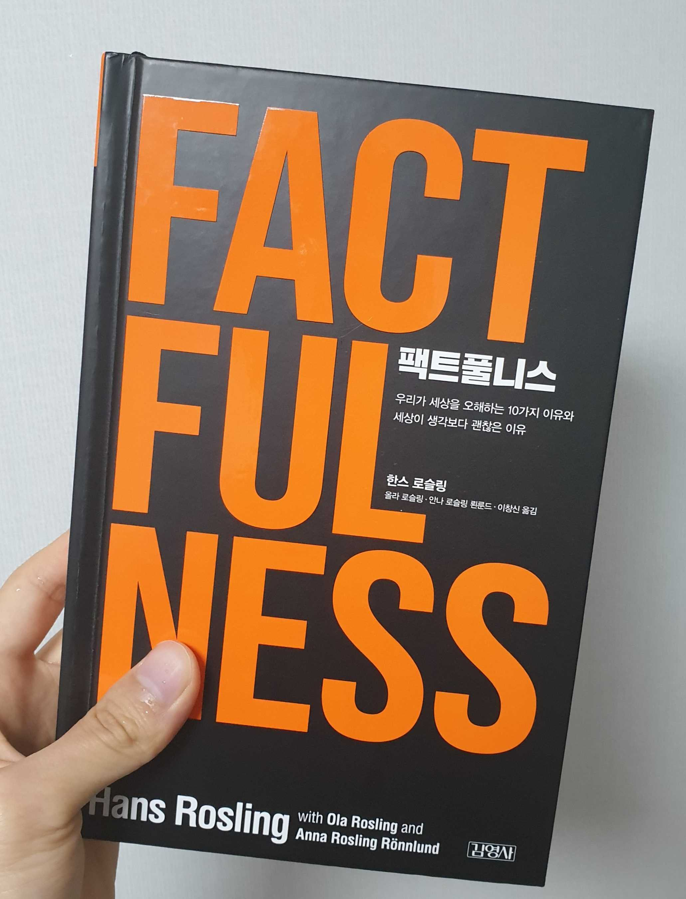

우리는 세상이 점점 불행하고 위험해지고 있다고 생각한다. 작가는 이러한 오해의 원인이 인간의 10가지 본능과 업데이트되지 않은 머릿속의 오래된 데이터 때문이라고 말한다. 따라서 각각의 본능을 차례대로 소개하고 잘못 알고 있는 사실에 대한 팩트를 알려준다.

1. 간극 본능 : 세상을 양극으로 나누어 바라봄
2. 부정 본능 : 긍정보단 부정에 더 귀 기울임
3. 직선 본능 : 앞으로의 일들은 지금껏 그래왔던 것처럼 직선적으로 뻗어나갈 것이라 단정
4. 공포 본능 : 극단적이고 공포스러운 일에 더 신경 씀
5. 크기 본능 : 숫자나 사건 하나만 보고 중요성을 오판
6. 일반화 본능 : 못 사는 나라의 사람들은 모두가 가난하고 힘들 것이라는 생각처럼 개인과 집단을 일반화함
7. 운명 본능 : 타고난 특성이 사람, 국가, 종교, 문화의 운명을 결정한다는 생각
8. 단일 관점 본능 : 한 가지 원인으로만 현실의 문제를 바라봄
9. 비난 본능 : 왜 안 좋은 일이 일어났는지 단순하게 개인또는 특정 집단에게서만 이유를 찾으려함
10. 다급함 본능 : 위험이 임박했다고 느낄 때 즉각적으로 행동함

나는 완벽하게 세상을 오해하며 살아왔다. 발생 확률이 지극히 낮은 일에 대해 심각하게 고민했고 자극적인 뉴스에 동조해 세상이 점점 악해지고 있다며 걱정했다. 하지만 이런 오해들은 사실에 충실하지 못했기에 일어난 것이다. 세상은 확실히 나아지고 있으니 쓸데없는 걱정은 그만하고 내 할 일이나 열심히 하자.
