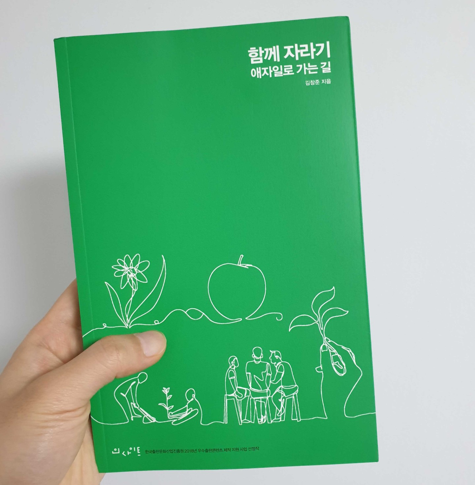

> 이번에 잘하냐 못 하냐 하는 것은 그렇게 중요하지 않습니다. 앞으로 기회가 수백, 수천 번 더 있다면 말입니다. 그런 경우 더 중요한 것은 지금 잘하냐가 아니라 지금 자라냐는 것입니다.

유수의 기업에서 교육과 컨설팅을 해오셨고 현재는 애자일 컨설팅 대표로 계신 [김창준](http://agile.egloos.com/)님이 집필하신 책이다.

매번 `성장`을 갈급해하지만 어떻게 하는 것이 내가 성장하는 길이고 효율적으로 발전할 수 있을지에 대해선 막막했다. 성장을 고민하고 있다면 함께 자라기를 꼭 읽어보라는 코딩도장에서의 조언을 기억만 하고 있다가 최근 그 기억을 끄집어내어 책을 구매하고 읽었다.

이 책은 자라기, 함께, 애자일 세 파트로 구성되어 있다. 각 파트에 대해 간략하게 요약해보겠다.

`자라기` 파트에서는 자기계발의 중요성, 성장을 위한 의도적인 수련, 피드백의 중요성, 실패를 통한 학습 등 전문가로 자라기 위해 갖춰야 하는 학습의 자세를 설명하고 있다. 우리가 평생 이를닦아왔지만 양치의 전문가라고 할 수 있을까? 이닦는 훈련을 의식적으로 하지않았기 때문에 전문가라고 할만큼 전문적이지못하다. 내가 특정 분야의 전문가로 인정받고 싶다면 해당 분야에서 의식적인 훈련을 끊임없이 시도하자.

`함께` 파트는 협력의 중요성에 대해 다루고있다. 뛰어난 개발자라고 하면 골방에 갇쳐 컴퓨터만 만지고 있고 사회성은 부족한 천재의 이미지를 떠올리곤 한다. 하지만 실제로 실력이 뛰어난 개발자는 커뮤니케이션, 협력 능력이 뛰어나다. 즉 협력하는 것은 전문가가 되기 위한 필수조건이다. 또 협력을 잘하려면 신뢰가 높아야하는데 이를 위해선 투명해야하며 공유하고 인터랙션 해야한다.

마지막으로 `애자일` 파트는 제목 그대로 애자일에 대해 말한다. 애자일을 한 문장으로 압축하여 '고객에게 매일 가치를 전하라' 로 표현하는데 각 단어들이 애자일을 담고있다. 또 애자일 도입의 긍정적인 효과를 예시를 통해 보여준다.

'경력이 높으면 전문성도 높을꺼야' 또는 '실수는 최대한 예방하는 것이 좋아'와 같은 잘 못 알고 있는 통념들을 깨버리고 진짜로 성장하려면 어떻게 해야 하는지 올바른 방향을 제시해준다. 꼭 개발자가 아니더라도 내가 일하는 분야의 전문성을 키우고 싶은 분들에게 이 책을 강력히 추천한다.
