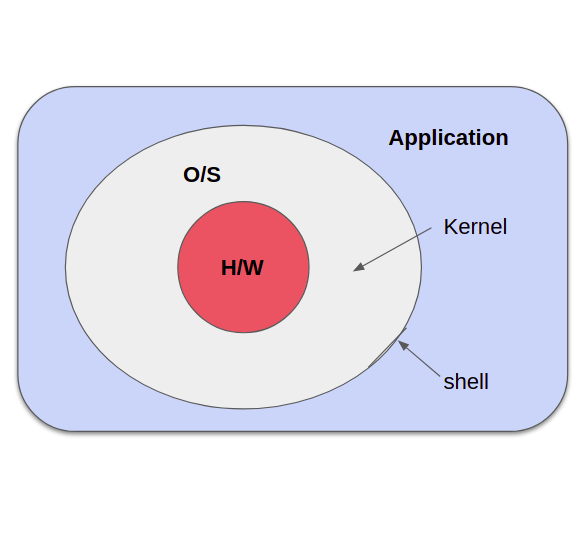

## 운영체제

> - 프로그램 : 메모리에 기록된 명령(instuction)의 집합
> - 내장형 컴퓨터 : 프로그램을 미리 메모리에 내장해두고 실행하는 구조의 컴퓨터

운영체제가 없는 PC는 어떤 상태일까?

- 파워를 켰을 때 운영체제가 없다면 메인 메모리(휘발성)엔 자기 멋대로(임의의) 값이 들어가 있다.
- 어떤 명령을 들고 와서 실행하려 해도 임의의 값이 들어있어서 할 수 있는 게 없다.
- 운영체제가 없는 컴퓨터는 전혀 제어가 안되는 야생마와 같다.

프로그램을 실행하려면?

- 하드디스크에 있는 실행파일을 메모리에 올려야 프로그램이 실행이 된다. 그렇다면 어떻게 메모리에 올릴 수 있는가? 운영체제가 메모리에 파일을 올리는 역할을 해준다. 또 프린터에 인쇄명령, 여러개의 프로그램 동시실행, 디스크에 파일저장 등의 일도 운영체제가 수행한다.

운영체제는
1. `Performance` (성능을 높인다)
2. `Convenience` (사용자가 원하는대로 할 수 있는 편의성을 제공한다)
  
    1940 50년대에는 OS가 미약했기 때문에 사용법이 어려웠고 일반인은 컴퓨터를 사용하지 못했음(Operator가 존재)

3. `Control program for computer` (컴퓨터 하드웨어를 관리한다)

## 부팅

컴퓨터의 전원을 키면 어떤일이 일어날까?

### 컴퓨터 구조

> 컴퓨터 = Processor + Memory(RAM + ROM) + 보조기억장치
> - RAM (Random Access Memory) : 휘발성 메모리라 전원을 껐다키면 사라짐
> - ROM (Read Only Memory) :  전원을 껐다켜도 메모리가 유지됨

#### 1. 파워를 껐다 키면 프로세스는 제일 먼저 ROM을 읽어와서 실행한다

ROM에는 어떤 프로그램을 넣어둬야 하는가?

- POST(Power-On Self-Test)
  
  - 전원을 키면 컴퓨터가 환경설정이 잘 되어 있는가를 스스로 테스트함

- Boot loader
  
  - 하드디스크를 뒤져서 OS를 메인메모리의 RAM영역으로 가져옴
  - booting : 메인메모리로 올라오는것을 부팅이라고 함
  - booter : 끌어당긴다

두가지 일을 하고나면 ROM(파워를 켰을 때 처음에만 필요함)의 역할은 끝남

#### 2. OS가 메인메모리에 올라간다

- 윈도우 : 바탕화면, 아이콘 등 초기화면이 나타남
- 리눅스 : Login 프롬프트가 뜸

지금부터 모든 명령을 받아드릴 준비가 되었습니다. - OS -

#### 3. OS가 메인메모리에서 내려오려면

- OS는 Memory Resident(메모리에 상주한다) 라고도 불림
- 즉 메모리에 상주하기에 컴퓨터 전원을 꺼야 메인 메모리에서 내려온다

## 운영체제의 위치

- H/W : 컴퓨터의 가장 내부에 있음
- OS : 커널(kernel) + 명령 해석기(shell, command interpreter)
- kernel(핵) : H/W를 감싸고 있으며 H/W를 제어하고 관리
- shell(조개껍질) : OS의 껍질, OS에 명령을 내릴 수 있게 함
- Application(응용 프로그램) : 가장 바깥에 있음, OS 위에서 실행됨

디스크에 hwp파일이 있어도 리눅스에선 실행할 수 없는 이유는 OS에 hwp를 읽는 명령어가 없기 때문이다.

## 운영체제의 역사

### Batch processing system (일괄처리)
  
- resident monitor
- 최초의 OS
- 컴파일 - 링크 - 로드 등의 일련의 일을 컴퓨터가 스스로 할 수 있게 메모리에 넣어두자. Operator가 하는 일의 수고를 덜자

그 위에 여러기술이 발전이 됨
하드웨어 기술이 발전하면서 OS에도 큰 변화가 생김

### Multiprogramming system (다중프로그래밍)
  
- CPU가 동작하다가 i/o가 동작하다가 다시 cpu동작하다가를 반복하는데 이 때 i/o중에 CPU가 아무일도 안하고 놀고있음(idle)

- CPU를 놀리지 않으려면? → 메모리에 여러 개의 job을 돌리자! i/o가 일어나는 동안에도 CPU가 계속 일하도록 함
  
- 생각하게된것 :
  - CPU scheduling(메인메모리에 프로그램이 여러개면 뭐부터 실행하는게 좋을까?)
  - 메모리 관리(유저프로그램을 각각 어느위치에 놓아야할까?)
  - 보호(다른 프로그램 영역에 침범하지 못하게 해야해)

### Time-Sharing System (시공유 시스템)
  
- 스위칭이 빠른시간에 자주 일어나게 하여 사용자로 하여금 혼자서 쓰는것처럼 느껴지게 한다.

- 예전엔 컴퓨터가 비싸서 하나의 컴퓨터에 여러 단말기(terminal)를 붙여서 사용함 -> 멀티프로그래밍시 A가 사용하면 B는 사용하지 못하는 문제가 발생함 -> 한번에 동시에 사용하게하려면? -> 아주 짧은 시간(1/100초)에 A를 처리하고 아주 짧은 시간에 B를 처리하고... 스위칭함 -> 조금씩 일하고 스위칭하고 조금일하고 다시 스위칭함 -> 유저가 3명이면 한명당 1초에 33번의 CPU를 사용할 수 있고 이는 혼자 컴퓨터를 사용하는것 처럼 느끼게 함

- 강제 절환
- interactive system (컴퓨터와 상호 대화가 가능해짐)
- 가상 메모리(사용자가 많아지면 메인메모리가 부족해짐 -> 하드디스크의 일부를 메인메모리처럼 사용함)
- 프로세스간 통신이 가능해짐
- 동기화(3명의 유저가 거의 동시에 실행되다 보니 누가 앞서야하는지 결정)

대표적인 TSS : Unix(1960년대 말), Linux

## 고등 운영체제

- 다중 프로세서 시스템(CPU가 여러개)
  - 병렬 시스템, 강결합 시스템(강하게 결합되었다) 이라고도 함
  - 만든 이유는?
    1. performance (더 많은 계산을 하기위해)
    2. cost (저렴한 CPU여러개를 두는게 더 효율이 좋음)
    3. reliability (고장나면 다른녀석으로 대체 가능)
  - 다중 프로세서 운영체제가 필요

- 분산 시스템(CPU-Memory 조합을 통신망으로 여러개 연결함)
  - 다중 컴퓨터 시스템, 소결합 시스템 이라고도 함
  - 분산 운영체제가 필요
  - 목적은 다중 프로세서 시스템과 동일

- 실시간 시스템(Real-time system / 특정 시간내에 반드시 계산을 끝내야 하는 시스템)
  - 시간제약 : Dead-line
  - 네비게이션, 공장 자동화, 군사, 항공, 우주
  - 실시간 운영체제가 필요

## Reference

- http://www.kocw.net/home/search/kemView.do?kemId=978503
