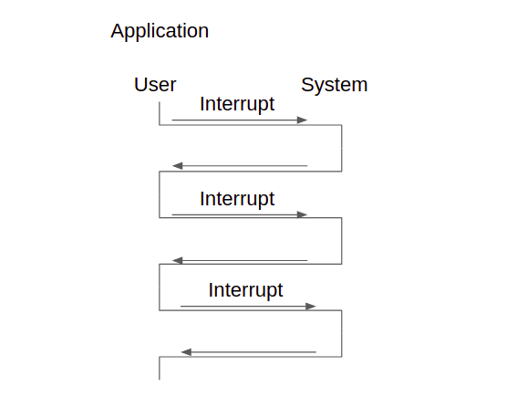
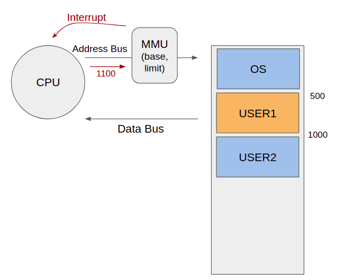

한 컴퓨터를 여러 사람이 동시에 사용하는 환경(서버 컴퓨터)이 있다. 또는 PC나 스마트폰같이 한 사람이 여러 프로그램을 동시에 사용하는 환경도 있다. 이 때 누군가 고의 또는 실수로 프로그램 전체에 해악을 가하면 다른 사용자들은 피해를 입는다. 이를 방지하기 위해 이중모드가 나왔다.

### 만약 사용자가 프로그램내에서 STOP명령(CPU를 중지하는 어셈블리어 명령)을 내리면 어떻게될까?

1. 메인메모리로 STOP명령이 올라가고, 명령이 실행된다
2. CPU가 멈추게되는데 이 때 CPU를 다시 가동시키려면 컴퓨터를 껐다켜야한다.
3. 만약 서버컴퓨터를 사용중이라면 서버컴퓨터는 부팅이 오래걸려 사용자들은 피해를 입게된다.

이렇듯 STOP과 같은 명령어를 아무나 사용할 수 있게 되면  치명적인 일이 발생한다. 따라서 일반 사용자가 이런 치명적인 명령을 내리지 못하게 관리자에게만 권한을 부여하여야 한다.

### 어떻게 해야 사용자가 치명적인 명령을 내리지 못하게 할 수 있을까?

해서 나온것이 이중모드이다. 이중모드는 말그대로 CPU가 동작하는 모델을 이중(두가지)으로 한다. 하나는 사용자모드 다른 하나는 관리자 모드로 두는것이다.

OS에 있는 명령을 실행할때에는 `관리자모드`로, 일반 사용자영역에 있는 메모리를 읽어올때에는 `사용자모드`로 동작하게 한다.

> 관리자모드(supervisor) = 시스템모드 = 모니터모드(감시자) = 특권모드(priviliged mode)

> 특권명령(관리자모드에서만 내릴 수 있는 명령)엔 무엇이 있을까?
> - STOP, HALT, RESET, SET_TIMER, SET_HW,...

### 이중모드는 어떤식으로 만드는가?

CPU안에 레지스터가 있고 레지스터는 플래그를 띄고 있는 여러 비트들로 구성되어있다. 해당 레지스터에 이중모드를 나타내는 플래그 비트를 추가하여 이중모드를 만들게된다.

### 이중모드의 동작 과정

파워를 키면 부팅이 일어나서 OS가 디스크에서 메인메모리로 올라간다. 올라가는 와중엔 이중모드 플래그가 `1`로 설정되어있다. 즉 시스템 모드에서 동작중임을 알려준다. 부팅이 끝나면 사용자 프로그램을 클릭해서 메인메모리에 사용자프로그램을 올리는데, 이 때 OS는 레지스터의 이중모드비트를 `0`으로 바꿔주어 사용자 모드에서 동작하도록 한다.

만약 게임프로그램을 돌린다고 하면 게임이 끝나고 스코어를 디스크에 저장하고 싶다. 디스크저장을 게임프로그램이 직접하게되면 사용자프로그램이 디스크에 직접 접근하게되고 이는 디스크의 다른 파일에도 접근할 수 있음을 의미한다. 보안에 심각한 문제가 생길 수 있다. 따라서 OS에게 소프트웨어 인터럽트를 사용하여 저장해달라는 부탁을 한다. 인터럽트를 통해 OS로 가면 이중모드 비트가 1로 변경되므로 디스크에 접근할 수 있게 된다. 디스크에 저장하고 나면 다시 게임프로그램으로 돌아가게되고 이중모드 비트는 0으로 변경된다.

컴퓨터는 끊임없이 사용자모드와 시스템모드를 왔다갔다하며 작업을 수행한다.

### 사용자모드에서 STOP명령을 내린다면 어떤일이 일어날까?

CPU는 STOP 명령을 받고 이중모드 비트를 확인한다. 사용자모드이기 때문에 당연히 0인 상태이다. CPU는 STOP이 잘못된 명령이라고 인식하고 내부인터럽트를 발생시킨다. STOP을 실행하는 대신 OS에 있는 ISR로 이동한다. 잘못된 명령을 내렸을 때 처리하는 루틴으로 점프하여 프로그램을 강제로 종료시킨다.

## 보호

이중모드는 보호와도 관련이 있다. 일반유저가 아무명령을 내려 서버를 다운시키면 그 해악이 많은 사람들에게 미치기때문에 막아줘야 한다.

보호받아야할것이 세가지가 있는데 무엇인지 알아보자

### 1. 입출력장치 보호

사용자의 잘못된 입출력 명령으로 부터 보호한다.

- 다른 사용자의 입출력, 정보 등에 방해
- 예: 프린트 혼선, 리셋 등
- 예: 다른 사람의 파일 읽고 쓰기 (하드디스크)

해결법

- `아무유저나 입출력 명령을 내리지 못하게 입출력 명령을 특권명령으로 한다` - IN(입력장치로부터 정보를 받아들임), OUT(출력장치에 출력명령을 내림)
- 입출력을 하려면 운영체제에게 요청하게한다 (system mode 전환)
- 운영체제가 입출력 대행, 마친 후 다시 user mode 복귀
- 올바른 요청이 아니면 운영체제가 거부 (나는 A인데 B정보를 읽고싶어!)

사용자가 입출력 명령을 직접 내린 경우?

- Privileged instruction violation (특권 명령을 침범)

### 2. 메모리 보호

다른 사용자 메모리 또는 운영체제 영역 메모리 접근으로 부터 보호한다. (user1이 user2의 메모리에 접근하려한다던가, OS에 접근하여 ISR을 변경할 수도 있음)

- 우연히 또는 고의로
- 다른 사용자 정보/프로그램에 대한 해킹
- 운영체제 해킹

해결법

- Address Bus에 문지기(MMU)를 둔다. User1 프로그램이 돌때 주소가 500 ~ 1000번지 사이면 문지기가 통과시키지만 범위를 넘어서는 주소가 들어오면 CPU에게 인터럽트 신호를 보낸다.

- 문지기는 어떻게 만드나? 레지스터로 만들며 base, limit값으로 들어오는 값의 주소 범위를 알 수 있다. base, limit값은 함부로 변경해선 안되므로 특권명령을 이용해야 한다. 따라서 OS만이 MMU설정을 바꿀 수 있다.

- `MMU 를 두어 다른 메모리 영역 침범 감시하도록` (Memory Management Unit)

다른 사용자 또는 운영체제 영역 메모리 접근 시도?

- Segment violation (영역 침범)

### 3. CPU 보호

한 사용자가 실수 또는 고의로 CPU 시간을 독점하는것으로 부터 보호한다.

- 예: while (n = 1) … 무한루프
- 다른 사용자의 프로그램 실행 불가

해결법

- `Timer 를 두어 일정 시간 경과 시 타이머 인터럽트`를 발생시킨다.
- 인터럽트 > 운영체제 > 다른 프로그램으로 강제 전환
