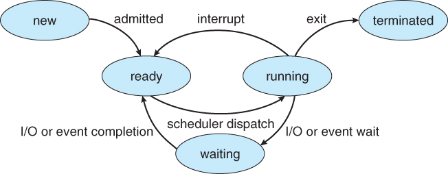
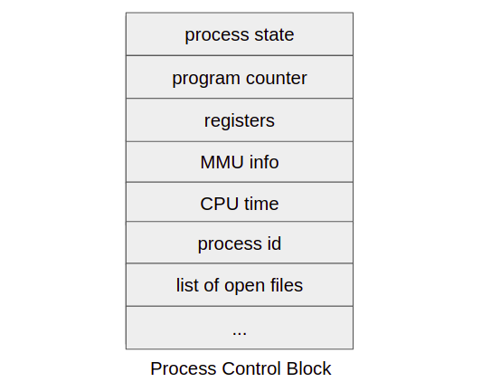
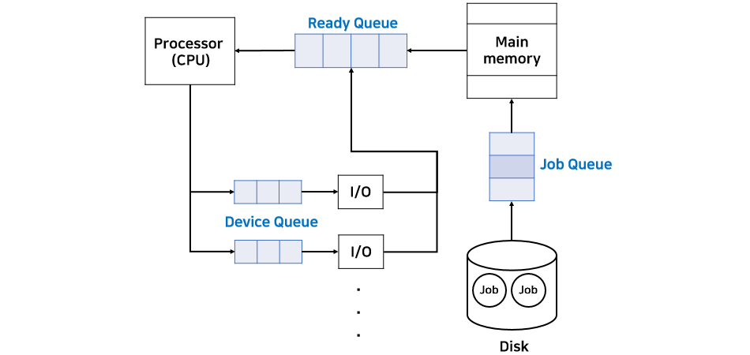

실행중인 프로그램을 프로세스라고 하고 다른말로 task, job이라고도 부른다. 디스크에는 있지만 실행중이 아닌 프로그램은 프로세스가 아니다.

### 프로세스 상태

- New : 하드디스크안에 프로그램이 메인메모리로 올라온 상태
- Ready : 메인메모리에 올라온 프로그램이 모든 초기화를 끝내고 실행 준비가 된 상태

- Running : CPU가 프로그램을 실행중인 상태

- Waiting : 프로세스가 끝나지 않은 시점에서 I/O로 인해 CPU를 사용하지 않고 다른 작업을 한다. (해당 작업이 끝나면 다시 CPU에 의해 실행되기 위해 ready 상태로 돌아간다)

- Terminated : 프로세스가 종료된 상태

### PCB

Process Control Block (= Task Control Block)

블록안에 프로세스에 대한 모든 정보가 들어있다.
하나의 프로세스에 하나의 PCB가 할당된다.

프로세스에 대한 정보는 무엇이 있을까?

- process state : 프로세스가 어떤 상태인지 (new, ready, ...)
- program counter : 다음에 몇번지를 실행할 것인지, 몇번지에서 시작되었고 지금은 몇번지에 있는지
- register : 다른 레지스터에 대한 정보(시간초과 또는 IO를 만나서 다른작업을 하다가 다시 돌아왔을 때 이전 상태로 복구하기 위해)
- MMU info : 프로세스가 스위칭 될때마다 base, limit값을 얼마로 해야하는지
- CPU time : 현재까지 CPU를 얼마나 사용했는가(너무 많이 사용했으면 좀 적게 사용하자)
- PID : 프로세스마다 번호를 붙여서 프로세스를 구분함
- list of open files : 어떤파일들을 사용하고 있는가

PCB는 어디 들어가있는가?

- OS안에 프로세스 관리 부서에 들어가있다

### Queues

#### Job Queue

- 디스크에 있는 프로그램이 메인 메모리로 올라가려면 해당 큐에서 줄을 서야 한다.
- Job(long-term) scheduler : 줄 선 프로그램 중에 어떤 프로그램을 먼저 올려줘야 할지를 결정한다. 프로세스가 비워질 때에만 결정을 하기에 자주일어나지 않는다.

#### Ready Queue

- 메인메모리에 올라와서도 CPU에게 실행되기 위해서는 해당 큐에서 줄을 서야한다.
- CPU(short-term) scheduler : 줄 선 프로그램중에 어떤프로그램을 선택하여 서비스 해줄지 결정한다. 1초에도 수십 수백번씩 일어난다.

#### Device Queue

- 디바이스를 사용하려면 해당 큐에서 줄을 서야한다.
- Device scheduler

### Multiprogramming

메인 메모리에 여러개의 프로그램을 올리는 것을 말한다.

#### Degree of multiprogramming

- 멀티프로그래밍의 정도(수준)
- 메인 메모리에 프로세스가 몇개 올라가있는가

#### i/o-bound vs CPU-bound process

프로세스를 크게 두가지종류로 나눌 수 있다.

- i/o-bound : 주로 I/O 관련 작업을 하는 프로세스 (문서편집)
- CPU-bound : 주로 CPU를 사용해서 계산하는 프로세스(일기예보)

i/o-bound 프로세스만 올리면 CPU가 할일이 없고 CPU-bound프로세스만 올리면 CPU만 바쁘고 I/O가 할일이 없어진다. 따라서 Job-scheduler는 둘을 적절히 할당해줘야 한다.

#### Medium-term scheduler

Short-term보단 자주일어나고 Long-term보다는 더디게 일어나는 스케줄러를 말하며 메모리를 뒤져서 현재 사용되지 않는 프로세스가 무엇인지를 찾는 역할을 한다.

- 메모리를 A,B,C 라는 프로세스가 사용하고있다고 가정해보자. B가 일을 하다가 잠시 쉬기로 했다. OS는 컴퓨터 성능향상을 해야할 의무가 있으므로 자리만 차지하고 있는 B의 자원이 아깝다고 생각한다. 따라서 메모리에서 B를 쫓아내고 그 자리에 다른 프로세스를 올리거나 A,C 에게 메모리를 나눠줄 수 있다.
- Swap-out : 메모리에 올라온 프로세스를 하드디스크로 쫓아 내는것
- Swap-device(Backing Store) : 쫓아낸 프로세스들을 넣어두는 장치
- Swapping : Swap-device로 쫓아낸 프로그램을 다시 메모리로 올리는 작업

OS는 프로세스가 어느자리에서 쫓겨났고 어느자리로 가야하고를 추적하고 기억해야한다.

#### Context switching (문맥전환)

메인메모리에 프로세스가 여러개있어도 한 순간에는 하나의 작업만 한다. 따라서 다른 프로세스를 실행하기 위해 현재 실행중인 프로세스를 멈추고 다른 프로세스로 전환되는 것을 말한다.

- Scheduler : CPU Schduler를 말하며, 현재 실행중인 프로세스가 끝나고 다음엔 어떤 프로세스를 실행할지를 결정한다.
- Dispatcher : scheduler가 선택한 프로세스를 실행하기 위해 CPU의 여러 상태(PCB)를 바꾸어준다.
- Context switching overhead : Context switching이 발생할때 마다 dispatcher작업을 수행하는데 이 때 overhead가 발생할 수 있다. overhead를 줄이기 위해 dispatcher를 저수준언어로 구현하여 효율을 높이는것이 좋다.
