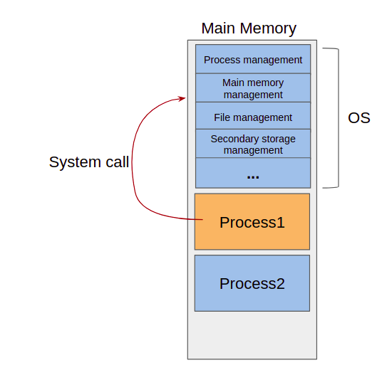

운영체제가 하는일이 무엇인지 구체적으로 알아봅시다.

### 프로세스 관리

#### Process management

#### 프로세스 (process)

- 메모리에서 실행 중인 프로그램 (program in execution)

#### 주요기능

- 프로세스의 생성, 소멸 (creation, deletion)
- 프로세스 활동 일시 중지, 활동 재개 (suspend, resume)
- 프로세스간 통신 (interprocess communication: IPC)
- 프로세스간 동기화 (synchronization) – 교착상태 처리 (deadlock handling)

### 주기억장치 관리

#### Main memory management

#### 주요기능

- 프로세스에게 메모리 공간 할당 (allocation)
- 메모리의 어느 부분이 어느 프로세스에게 할당되었는가 추적
및 감시
- 프로세스 종료 시 메모리 회수 (deallocation)
- 메모리의 효과적 사용
- 가상 메모리: 물리적 실제 메모리보다 큰 용량 갖도록

### 파일 관리

#### File management

- Track/sector 로 구성된 디스크를 파일이라는 논리적 관
점으로 보게

#### 주요기능

- 파일의 생성과 삭제 (file creation & deletion)
- 디렉토리(directory)의 생성과 삭제 (또는 폴더 folder)
- 기본동작지원: open, close, read, write, create, delete
- Track/sector – file 간의 매핑(mapping)
- 백업(backup)

### 보조기억장치 관리

#### Secondary storage management

- 하드 디스크, 플래시 메모리 등

#### 주요기능

- 빈 공간 관리 (free space management)
- 저장공간 할당 (storage allocation)
- 디스크 스케쥴링 (disk scheduling)

### 입출력 장치 관리

#### I/O device management

#### 주요기능

- 장치 드라이브 (Device drivers)
- 입출력 장치의 성능향상: buffering, caching, spooling

### 시스템 콜

#### System calls

- 일반 어플리케이션 프로그램이 운영체제 서비스를 받기 위한 호출

#### 주요 시스템 콜

- Process: end, abort, load, execute, create, terminate, get/set
attributes, wait event, signal event – Memory: allocate, free
- File: create, delete, open, close, read, write, get/set attributes
- Device: request, release, read, write, get/set attributes,
attach/detache devices
- Information: get/set time, get/set system data
- Communication: socket, send, receive
