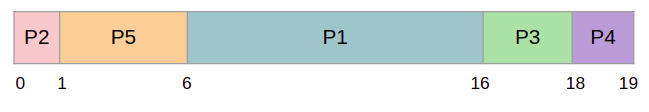

Ready Queue 또는 메인메모리에 여러 프로그램들이 줄서서 기다리고 있을 때 현재 실행중인 프로세스가 끝나면 다음 프로세스는 무엇을 실행시킬것인지 결정하는 작업을 CPU 스케줄링이라고 한다.

### Preemptive vs Non-preemptive

Preemptive(선점) : CPU가 어떤 프로세스를 지금 막 실행하고 있다. CPU의 작업이 끝나지도 않았고 I/O를 만나지도 않았는데 강제로 쫓아내고 새로운 작업이 들어오는 것을 허락한다.

Non-preemptive(비선점) : 현재 프로세스가 실행중이면 프로세스가 끝나거나 I/O를 만나지 않는이상 스케줄링이 발생하지 않는다.

### Scheduling criteria

스케줄링의 효율을 분석하는 기준

- CPU Utilization (CPU 이용률) : CPU가 얼마나 부지런히 일하는가
- Throughput (처리율) : 단위시간당 몇개의 작업을 처리하는가
- Turnaround time (반환시간) : 작업이 Ready queue에 들어가고부터 작업을 끝내고 나올 때까지 걸린 시간
- Waiting time (대기시간) : CPU의 서비스를 받기위해 기다린 시간
- Response time (응답시간) : 처음 응답이 나올 때 까지 걸리는 시간. Interactive system(대화형)에서 중요한 척도가 된다.

## CPU Scheduling Algorithms

### First-Come, First-Served (= FIFO)

먼저 온 프로세스를 먼저 서비스하는 스케줄링이다. 병원, 은행등 일반적으로 현실에서 많이 사용되며 간단하며 공평한 방식이다. 하지만 반드시 좋은 성능을 보장하진 않는다.

Burst Time : CPU 시간을 얼마나 사용할것인가

|    Process    | Burst Time (msec)|
|:-------------:|:-------------:|
|       P1      |       24      |
|       P2      |       3       |
|       P3      |       3       |

AWT(Average Waiting Time) = (0 + 24 + 27) / 3 = 17 msec

AWT = (6 + 3 + 0) / 3 = 3 msec

들어온 순서대로 서비스하는것 보다 짧은 시간의 프로세스를 먼저 처리하는게 더 효율적인것을 확인할 수 있다.

- Convoy Effect (호위효과) : CPU실행시간이 오래 걸리는 프로세스가 앞에 있으면 뒤에 프로세스들은 하염없이 기다려야한다. 마치 P1을 기준으로 P2 P3가 따라다니며 호위하는것 처럼 보이는 효과를 말한다. FCFS의 큰 단점이다.

- Nonpreemptive scheduling

### Shortest-Job-First (SJF)

실행시간이 가장 짧은것부터 서비스하는 스케줄링.

|    Process    | Burst Time (msec)|
|:-------------:|:-------------:|
|       P1      |       6       |
|       P2      |       8       |
|       P3      |       7       |
|       P4      |       3       |

AWT = (3 + 16 + 9 + 0) / 4 = 7 msec

AWT = (0 + 6 + 14 + 21) / 4 = 10.25 msec (FCFS)

SJF는 대기시간을 줄이는 측면에서는 가장 좋은 방법이다. 하지만 **비현실적인** 스케줄링인데, 실제 프로세스가 CPU시간을 얼마나 사용할지 알 수 없기 때문이다.

예측할 수 있는 방법은 없을까? Time sharing의 경우 하나의 프로그램이 종료될 때 까지는 반복적인 작업을 수행한다. 반복될 때 마다 OS는 사용된 CPU시간을 조사해서 다음 CPU시간을 예측할 순 있다. 하지만 과거를 다 기억해야하고 예측이 맞는지를 일일이 계산해야 하므로 많은 오버헤드가 발생한다.

#### Preemptive or Nonpreemtive

SJF는 Preemptive, Nonpreemtive 둘다 사용할 수 있다.

  |    Process    |  Arrival Time | Burst Time (msec)|
  |:-------------:|:-------------:|:-------------:|
  |       P1      |       0       |       8       |
  |       P2      |       1       |       4       |
  |       P3      |       2       |       9       |
  |       P4      |       3       |       5       |

#### Preemptive

Shortest-Remaining-Time-First (최소잔여시간 우선)

AWT = (9 + 0 + 15 + 2) / 4 = 6.5 msec

P1이 도착하여 서비스를 시작한다. 1초에 P2가 도착했을 때 P2(4)가 P1(7)보다 짧으므로 스위칭한다. 2초에 P3(9)가 도착했지만 더 짧은 P2(3)를 계속 실행한다. 3초에 P4(5)가 도착했어도 P2(2)가 짧으므로 계속 진행한다. P2가 다 실행됐으면 그 다음으로 짧은 P4 P1 P3 순으로 진행한다.

#### Nonpreemptive

AWT = (0 + (8 - 1) + (17 - 2) + (12 - 3)) / 4 = 7.75 msec

### Priority

우선순위가 높은것 부터 서비스한다. 우선순위는 내부요소, 외부요소로 정할 수 있다.

- Internal: time limit, memory requirement, i/o to CPU burst, …
- External: amount of funds being paid, political factors, …

|    Process    |  Burst Time   |    Priority   |
|:-------------:|:-------------:|:-------------:|
|       P1      |       10      |       3       |
|       P2      |       1       |       1       |
|       P3      |       2       |       4       |
|       P4      |       1       |       5       |
|       P5      |       5       |       2       |

AWT = (6 + 0 + 16 + 18 + 1) / 5 = 8.2 msec

#### Preemptive or Nonpreemptive

둘다 사용 가능하다

#### 문제점

P1, P2, P3 프로세스가 줄서서 기다리고 있고 현재 P4를 서비스중이라고 하자. P4가 끝나고 나면 줄서있는 프로세스중 우선순위가 가장 높은 프로세스를 선택한다. P2가 가장 낮은 우선순위를 갖고있다고 하자. P2는 아무리 오래 기다려도 우선순위가 높은 새로운 작업이 들어오기 때문에 자기차례가 오지 않는다. 이를 **starvation**(기아) 라고 한다.

#### 해결책

Ready Queue를 주기적으로 조사하여 오래기다릴 수록 우선순위를 조금씩 올려주는 **aging**을 이용한다.

### Round-Robin (RR)

RR은 작업이 끝날 때 까지 기다리는 것이 아니라 일정 시간 동안 실행한 후 실행 큐의 다음 작업으로 전환한다(**Preemptive scheduling**). 이 때 작업이 실행되는 일정 시간을 **Time quantum** 또는 **time slice**(10 ~ 100msec) 라 부른다. Time quantum값에 따라 효율이 달라지므로 **최적의 Time quantum값**을 잡는것을 목표로 해야 한다. RR은 주로 Time-sharing system (시분할/시공유 시스템)에서 이용된다.

|    Process    | Burst Time (msec)|
|:-------------:|:-------------:|
|       P1      |       24      |
|       P2      |       3       |
|       P3      |       3       |

- Time Quantum = 4msec
- AWT = (6 + 4 + 7) / 3 = 5.66 msec

- 타임 슬라이스를 무한대로 둔다면? FCFS와 동일
- 타임 슬라이스가 0 이면? Process sharing (3개의 프로세스가 거의 동시에 돌고있는것 처럼 느껴진다) - context switching overhead 발생

#### 반환시간이 측정 기준이라면

RR은 각 작업을 잠깐 실행하고 다음 작업으로 넘어가고 하면서 가능한 한 각 작업을 늘리는 것이 목표다. 반환 시간은 작업 완료 시간만을 고려하기때문에, RR은 거의 최악이며, 많은 경우 단순한 FIFO보다도 성능이 좋지 않게 된다.

### Multilevel Queue

다양한 성격의 프로세스를 동일한 큐에 줄세우는건 맞지 않다. 따라서 프로세스가 하는 일에 따라 여러 종류의 그룹으로 나누고 여러개의 큐에 다양한 알고리즘을 적용하는 스케줄링 기법이다.

#### Process groups

- System processes : OS 커널 수준의 프로세스
- Interactive processes : 유저 수준의 대화형 프로세스(게임)
- Interactive editing processes : 유저와 대화를 아주 많이함(워드)
- Batch processes : 대화형 프로세스의 반대인 것으로 일정량을 한번에 처리하는 프로세스(컴파일러)
- Student processes

#### Single ready queue → Several separate queues

- 각각의 Queue 에 절대적 우선순위 존재
- 또는 CPU time 을 각 Queue 에 차등배분
- 각 Queue 는 독립된 scheduling 정책

### Multilevel Feedback Queue

Queue를 여러개 두는점에서는 Multilevel Queue와 동일하다.

모든 프로세스는 하나의 입구로 진입한다. 너무 많은 CPU time 사용 시에 다른 Queue로, 기아 상태가 우려되될 때 우선순위가 높은 Queue 로의 점진적 이동이 일어난다.
