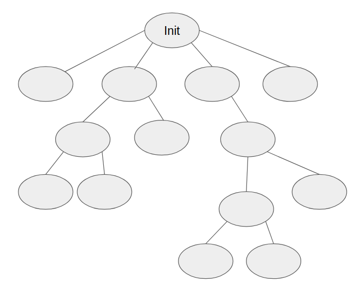

### 프로세스 생성과 종료

프로세스는 프로세스에 의해 만들어진다. 그렇다면 최초의 프로세스는 언제 어떻게 만들어질까? 부팅 후 OS가 메인 메모리에 올라가면 Init이라는 최초의 프로세스를 만들고 그 후로 자식처럼 프로세스가 프로세스를 만든다.

- 부모 프로세스 (Parent process)
- 자식 프로세스 (Child process)

프로세스 트리 (process tree)


#### Process Identifier (PID)

- 프로세스는 프로세스를 구분해주는 유일한 번호가 있다.
- 부모의 PID를 PPID라고 한다.

#### 프로세스 생성

프로세스를 생성하는 **시스템 콜**

- fork() : 부모 프로세스 복사
- exec() : 실행파일을 메모리로 가져오기
- exit() : 프로세스를 종료하고 해당 프로세스가 가졌던 모든 자원은 O/S 에게 반환(메모리, 파일, 입출력장치 등)

### 쓰레드

```java
class Test {
  public static void main(String[] args) {
    int n = 0;
    int m = 6;
    System.out.println(n+m);
    while (n < m)
    n++;
    System.out.println("Bye");
  }
}
```

위의 코드의 흐름을 살펴보면 main에서 프로그램이 시작되어 n에 0, m에 6을 넣고 n+m을 화면에 출력하고 반복문이 돌고...이렇듯 프로그램은 흐름, 맥이 있고 이를 쓰레드라고 한다.

한 프로그램에 2개 이상의 쓰레드가 있는 것을 **다중 쓰레드**(Multithreads)라고 한다. 쓰레드가 빠른 시간 간격으로 스위칭 되면 여러 쓰레드가 동시에 실행되는 것 처럼 보인다.

CPU가 하나인 환경에서 여러 쓰레드가 스위칭에 의해 동시에 수행되는 것 처럼 보이는 것을 **concurrent** 라고 한다. 반면 여러 쓰레드가 실제로 동시에 수행되는 것은 **simultaneous** 라고 한다. 다중 쓰레드는 전자이다.

- Web browser = 화면 출력하는 쓰레드 + 데이터 읽어오는 쓰레드
- Word processor = 화면 출력하는 쓰레드 + 키보드 입력 받는 쓰레드 + 철자/문법 오류 확인 쓰레드
- 음악 연주기, 동영상 플레이어, Eclipse ID

현대의 운영체제는 대부분 다중 쓰레드를 지원한다. P1 -> P2 -> P3 와 같이 **context-switching**이 프로세스 단위로 이루어지는 것이 아니라 P1(t1) -> P2(t1) -> P1(t2) -> P3(t1) -> P3(t2) -> P2(t2) 와 같이 프로세스 내부의 **쓰레드 단위**로 동작한다.

### Process vs Thread

한 프로세스에는 기본적으로 하나의 쓰레드가 존재한다. 프로세스는 **code, data** 메모리 공간이 존재하는데, 이는 여러 쓰레드가 공유한다. 이외에도 프로세스의 자원인 file, I/O 등은 여러 쓰레드가 공유하지만, PC(Program Counter), SP(Stack Pointer), registers, **stack** 등은 고유한 값을 갖고 있고 공유하지 않는다.
