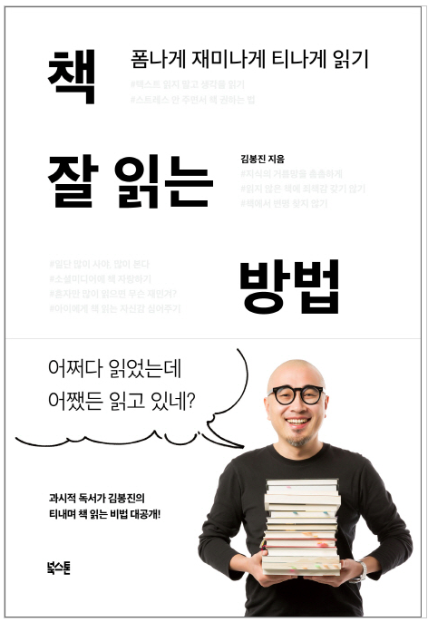

다독가로 알려져 있는 우아한 형제들의 김봉진 대표가 쓴 책이다.

나는 독서를 할 때면 현재 읽고 있는 책을 완독하기 전까진 다른 책을 읽어선 안된다는 이상한 강박이 있었다. 그래서 다소 흥미가 떨어지는 책을 읽게 되더라도 독서에 대한 애정이 떨어진 것이라 착각하며 지루하게 완독을 해왔다. 완독했을 때의 기분은 좋았지만 또 그런 책을 만나게 될까 두려워 독서를 미루게 된 적도 있었다. 이 책을 읽기 전 나의 상태가 딱 그러했는데 마침 진행 중인 독서모임에서 이 책을 추천받았다.

책을 펼쳤을 때 독서가 익숙하지 않은 사람들을 위한 저자의 배려를 볼 수 있었다. 글자가 페이지의 3분의 2를 넘어가지 않도록 구성해놓았는데 이는 독서에 대한 막연함과 부담을 줄이기 위한 장치인 것 같았다.

저자는 우리가 왜 책을 읽어야 하는지, 어떻게 해야 더 잘 읽을 수 있고 더 많이 읽을 수 있는지를 무겁지 않게 알려주고 있다. 특별히 인상 깊었던 부분을 떠올려 보자면 소설이 아닌이상 **순서대로 독서할 필요는 없다**, 글자를 읽지말고 **저자의 생각을 읽자**, 책을 읽다가 포기하고 싶어지면 **잠시 책장에 넣어두자** 등이 있었는데 독서에 임하는 자세를 다시금 생각하게 해주었다.

아무래도 책이 쉽게 읽히다 보니 완독했다는 기분을 내는 동시에 독서에 대한 부담감을 많이 내려놓을 수 있었다. 독서에 대한 피로감이 생길 때마다 다시 꺼내 읽어봐야겠다. 특별히 독서는 해야겠는데 엄두가 안나는분, 저 처럼 독서에 대한 피로감이 있는 분들에게 이 책을 추천한다.
