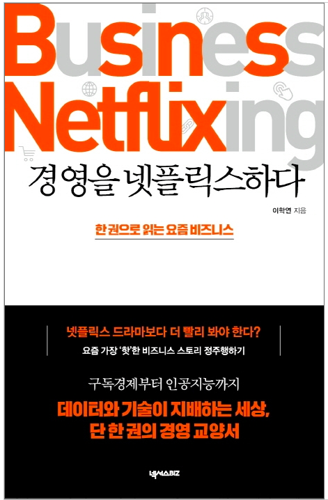

넷플릭스는 고유명사를 뛰어넘어 구독경제의 대명사가 되었다. 제목에서 볼 수 있듯이 '넷플릭스하다'라는 말도 **디지털 기술을 이용하여 비지니스를 혁신하다**라는 뜻을 가진 동사로 쓰이고 있다. 넷플릭스는 어떻게 이런 영향력있는 기업이 되었을까? 이 책에서는 넷플릭스를 비롯하여 현재 성공적으로 자리매김한 다양한 서비스들의 비즈니스 형태를 소개하고있다.

책은 총 세 파트로 구성되어 있으며 비즈니스 모델(기업들이 어떻게 돈을 버는지), 비즈니스 혁신(기업들이 어떻게 살아남는지), 비즈니스 지능(기업들이 어떻게 기회를 찾는지)과 사례에 대해 다루고있다. 그 중 창업에 대한 욕구를 불러일으켰던 가장 흥미로웠던 비즈니스 모델의 키워드를 간략히 정리해보겠다.

### 비즈니스 모델

- **Freemium** : 기본 기능은 무료로 제공하되, 추가 기능 또는 고급 기능을 유료로 판매하여 수익을 올리는 방식 (무과금으로도 즐길 수 있지만 과금을 하면 더 강력한 기능을 제공해주는 게임)

- **네트워크 효과** : 어떤 기술이나 서비스의 사용자가 많아질수록 개별 사용자가 얻을 수 있는 가치가 더욱 커지는 현상 (카카오톡)

- **플랫폼 비지니스** : 서로 다른 그룹의 참여자들이 상호작용할 수 있는 공간인 플랫폼을 조성하여 수익을 거두는 비즈니스 모델 (상품과 고객이 만나는 온라인 장소를 제공하는 온라인 쇼핑몰)

- **O2O 서비스** : 오프라인과 온라인이 연결되는 서비스(온라인 플랫폼으로 수요자 공급자를 연결시켜주고 오프라인에서 공유)

- **공유경제** : 제품을 직접 소유하지 않고, 다른 사람들과 공유하며 사용한 만큼만 요금을 지불하는 소비 형태

- **구독경제** : 한 번에 제품 가격을 지불하여 구매하지 않고, 매월 일정액의 사용료를 내며 제품을 사용하는 소비 형태

나는 마음 한편에 개발자로서 세상에 가치 있는 일을 하고 싶다는 꿈을 갖고 산다. 하지만 실제 어떻게 그 가치를 전달할지에 대해선 구체적으로 조사나 공부를 해본 적이 없다. 감사하게도 이 책을 통해 앞으로 어떤 비즈니스 모델이 사람들의 욕구를 충족시켜 줄지, 기술과 데이터의 융합이 어떤 새로운 가치를 창출할 수 있을지에 대해 진지하게 생각해볼 수 있었다.

넷플릭스나 유튜브와 같은 IT기업들이 왜 이렇게 핫하며 사람들이 찾는 이유가 무엇인지 궁금한 사람, 스타트업 창업을 준비하고 있는 사람은 이 책을 읽어보면 큰 도움이 될 것이다.
